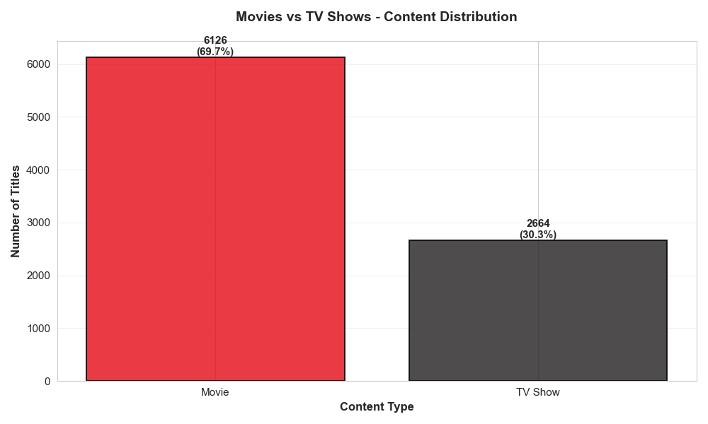
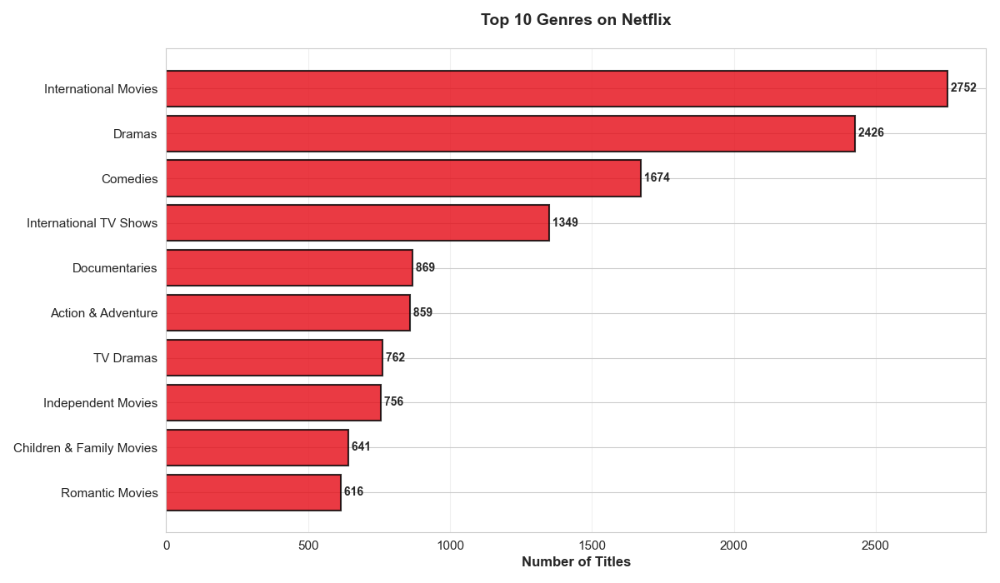
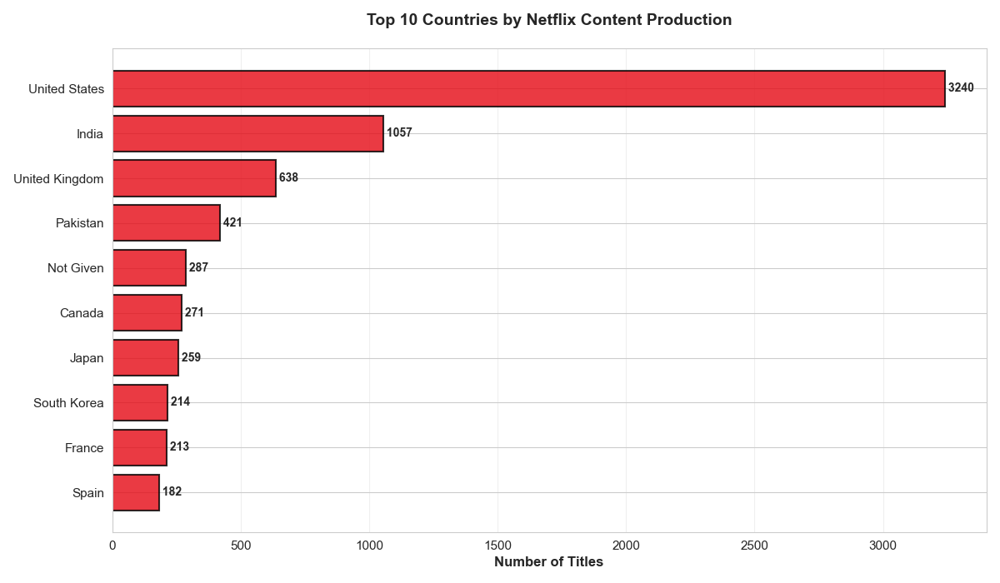
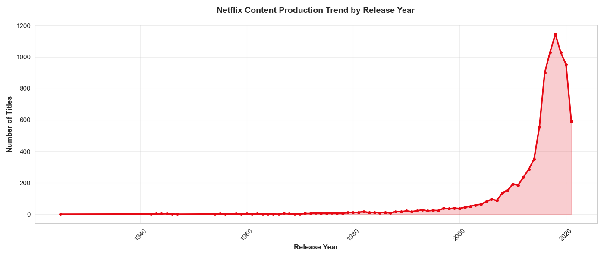
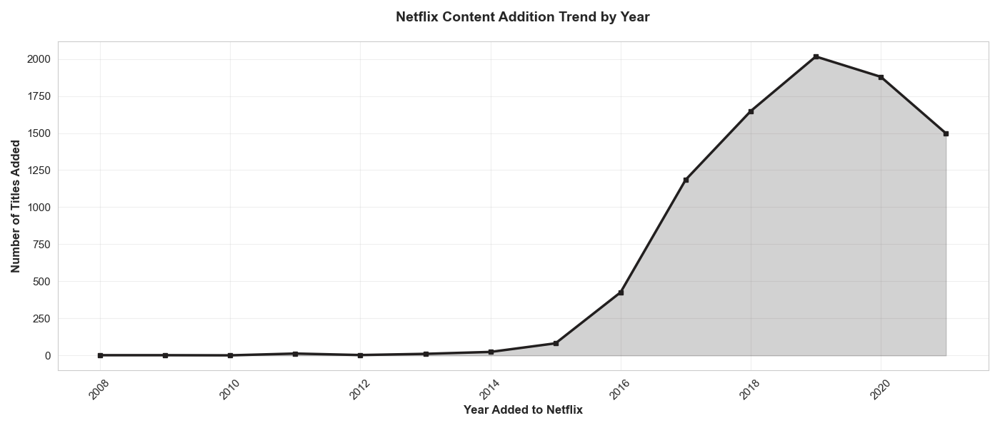
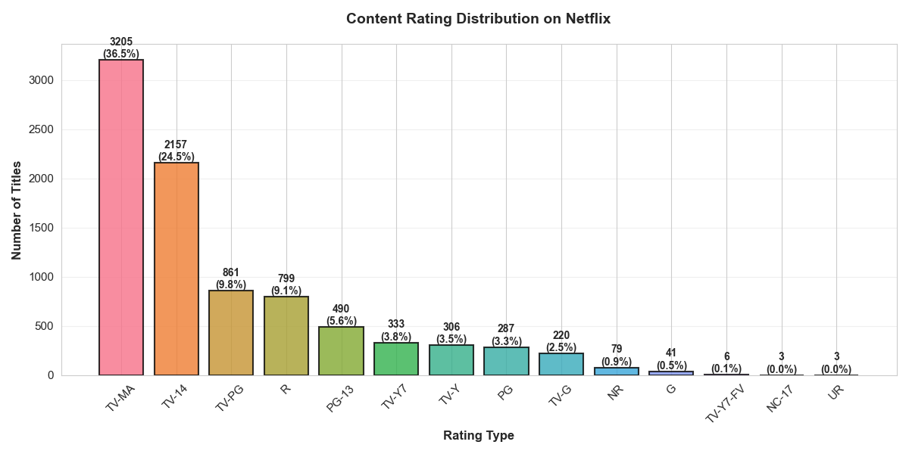
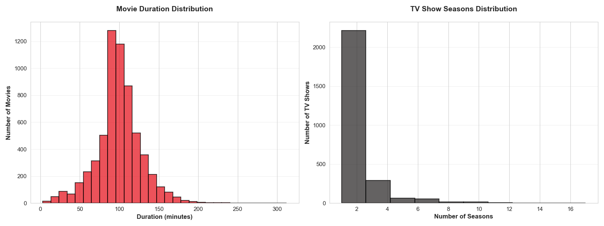

# 🎬 Netflix Titles — Cleaned Dataset & Results

**Author:** Abhinav Verma
**Last updated:** December 2025

This project cleans and analyzes a raw Netflix dataset and produces a single, analysis-ready CSV: `processed/netflix_cleaned.csv`. This README is the consolidated landing page for portfolio use and includes key results, simple dashboard images, and minimal steps to reproduce the pipeline.

---

## TL;DR

* Cleaned and standardized 8,800+ Netflix titles
* Reproducible Python ETL pipeline (raw → clean → analysis)
* Analysis-ready dataset + EDA notebook
* Focus on data quality, feature engineering, and insights

---

## 📊 Data Visualizations

### Content Overview

*Movies dominate the catalog at 70%, with TV Shows making up 30%*


*International Movies and Dramas lead, showing Netflix's global content strategy*


*United States and India are the top content producers in the catalog*

### Temporal Trends

*Content production exploded after 2015, peaking in 2018*


*Netflix rapidly expanded its library, adding 2,000+ titles in peak years*

### Content Details

*Mature content (TV-MA) is most common, followed by teen-oriented shows*


*Movies average 100 minutes; most TV shows have 1-2 seasons*

---

## 🧠 How This Was Built

* A deterministic ETL script (`scripts/data_processing.py`) normalizes columns, trims strings, parses dates and durations, deduplicates records, and adds light features (`duration_int`, `duration_type`, `cast_count`, `year_added`).
* The Jupyter notebook (`notebooks/EDA.ipynb`) contains exploratory analysis, charts, and short commentary.

---

## 🚀 Quick Start

```powershell
cd "d:\python projects\git\Netflix-Analysis"
pip install -r requirements.txt
python scripts/data_processing.py raw/netflix1.csv processed/netflix_cleaned.csv
jupyter notebook notebooks/EDA.ipynb
```

---

## 📁 Project Structure

```
Netflix-Analysis/
├── assets/                  # Dashboard figures (SVG)
├── notebooks/               # EDA notebook
│   └── EDA.ipynb
├── processed/               # Cleaned, analysis-ready data
│   └── netflix_cleaned.csv
├── raw/                     # Raw input dataset
│   └── netflix1.csv
├── scripts/                 # ETL / data processing code
│   └── data_processing.py
├── ANALYSIS_REPORT.md       # Executive-style summary of findings
├── CASE_STUDY.md            # Detailed methodology & decisions
├── requirements.txt         # Python dependencies
└── README.md                # This file
```

---

## 🧹 Data Cleaning Pipeline

The `data_processing.py` script performs multiple data quality improvements:

| Step | Operation            | Details                                  |
| ---- | -------------------- | ---------------------------------------- |
| 1    | Column normalization | Lowercase, strip whitespace, underscores |
| 2    | Text cleaning        | Trim leading/trailing spaces             |
| 3    | Deduplication        | Remove exact duplicate rows              |
| 4    | Null handling        | Drop incomplete titles; impute ratings   |
| 5    | Date parsing         | Convert dates to structured fields       |
| 6    | Duration extraction  | Parse minutes vs seasons                 |
| 7    | Feature engineering  | `cast_count`, temporal features          |
| 8    | Type conversion      | Enforce correct dtypes                   |
| 9    | Column ordering      | Logical layout for analysis              |
| 10   | Export               | Save production-ready CSV                |

The authoritative, final dataset is `processed/netflix_cleaned.csv` (8,790 rows).

---

## 💡 Key Findings (Summary)

* Significant catalog growth after 2015
* Movies account for ~70% of titles
* International movies and dramas dominate genre labels
* The USA is the largest producer; India is a strong second
* Typical movie runtime ~100 minutes; most TV shows have a median of 1 season

Detailed justification and visuals are available in `notebooks/EDA.ipynb` and `ANALYSIS_REPORT.md`.

---

## 🔧 Technologies & Skills

| Technology | Usage                        |
| ---------- | ---------------------------- |
| Python 3   | Primary language             |
| Pandas     | Data manipulation & cleaning |
| NumPy      | Numerical computation        |
| Matplotlib | Static visualizations        |
| Seaborn    | Statistical plotting         |
| Jupyter    | Interactive analysis         |
| Git        | Version control              |

**Skills Demonstrated:** Data cleaning, feature engineering, reproducible pipelines, exploratory analysis, documentation.

---

## 💼 Portfolio Value

This project demonstrates hiring-relevant skills:

| Skill             | Evidence                                |
| ----------------- | --------------------------------------- |
| Data Cleaning     | Robust handling of real-world messiness |
| Python            | Modular, production-ready scripts       |
| Data Analysis     | Insight generation from structured data |
| Visualization     | Clear, stakeholder-ready charts         |
| Reproducibility   | One-command end-to-end pipeline         |
| ETL / Engineering | Raw → Clean → Insights workflow         |

---

## 🤝 Contact

* **GitHub:** [https://github.com/Abhinav-TheAnalyst/Netflix-Analysis](https://github.com/Abhinav-TheAnalyst)
* **LinkedIn:** [https://www.linkedin.com/in/abhinav-theanalyst/](https://www.linkedin.com/in/abhinav-theanalyst/)

---

## 📜 License

Portfolio project View **MIT** [License](https://github.com/Abhinav-TheAnalyst/Netflix-Analysis/blob/main/LICENSE)

**Status:** ✅ Ready
**Purpose:** Portfolio project for Data Analyst / Data Engineer roles
