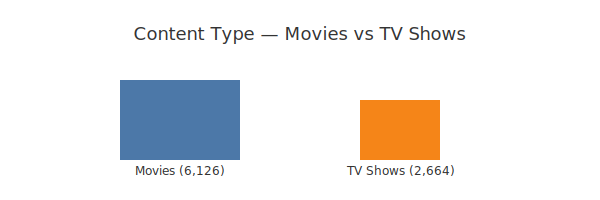
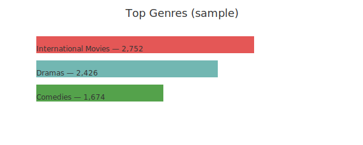
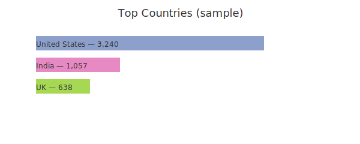

# 🎬 Netflix Titles — Cleaned Dataset & Results

Author: Abhinav
Last updated: December 2025

TL;DR
- I cleaned and analyzed a raw Netflix dataset and produced a single, analysis-ready CSV: `processed/netflix_cleaned.csv`. This README contains the key results, simple dashboard images, and the minimal steps to reproduce the cleaning.

Project dashboard







How I built this
- I wrote a small, deterministic ETL script `scripts/data_processing.py` that normalizes columns, trims strings, parses dates and durations, deduplicates, and adds a few light features (`duration_int`, `duration_type`, `cast_count`, `year_added`).
- The Jupyter notebook `notebooks/EDA.ipynb` contains the charts and short commentary. You can open the notebook to explore the visuals interactively.

Quick start
```powershell
cd "d:\python projects\git\Netflix-Analysis"
pip install -r requirements.txt
python scripts/data_processing.py raw/netflix1.csv processed/netflix_cleaned.csv
jupyter notebook notebooks/EDA.ipynb
```

Notes
- This README is the consolidated project landing page for portfolio use. The cleaned CSV is the canonical source for any metrics shown here.

Contact
- Abhinav — https://github.com/abhinav | https://linkedin.com/in/abhinav


## 📌 Project Overview

This portfolio project showcases:

### Dataset


## 📁 Project Structure

```
Netflix-Analysis/
This is a portfolio project I prepared to demonstrate my data engineering and analysis workflow.
If you'd like to discuss the code, methodology, or business insights, feel free to reach out:
├── processed/
## 📜 License
Portfolio project — Netflix dataset sourced from public datasets under their original terms.
│   └── EDA.ipynb                 # Jupyter notebook with analysis & visualizations
├── scripts/
**Status:** Completed
**Purpose:** Portfolio project for data engineering & analysis
├── CASE_STUDY.md                 # Detailed case study & methodology
└── README.md                      # This file
```


## 🛠 Installation & Setup

### Prerequisites

- Python 3.7+ and `pip` installed

### Step 1: Clone the repository
```powershell
git clone https://github.com/abhinav/Netflix-Analysis.git
cd "d:\python projects\git\Netflix-Analysis"
```

### Step 2: Create and activate a virtual environment (recommended)
```powershell
python -m venv venv
venv\Scripts\activate
```

### Step 3: Install dependencies
```powershell
pip install -r requirements.txt
```


## 🚀 How to Run

### Data cleaning pipeline
I used a small, deterministic ETL script to clean the raw CSV and produce the analysis-ready file.

Run the cleaner:
```powershell
python scripts/data_processing.py raw/netflix1.csv processed/netflix_cleaned.csv
```

### Exploratory data analysis
Open the notebook to view the analysis and visualizations:
```powershell
jupyter notebook notebooks/EDA.ipynb
```


## 🧹 Data Cleaning Pipeline

The `data_processing.py` script performs 10+ data quality improvements:

| Step | Operation | Details |
|------|-----------|---------|
| 1 | **Column Normalization** | Lowercase, strip whitespace, underscores |
| 2 | **Text Cleaning** | Remove leading/trailing spaces |
| 3 | **Deduplication** | Remove exact duplicate rows |
| 4 | **Null Handling** | Drop incomplete titles; impute ratings |
| 5 | **Date Parsing** | Convert dates → structured fields |
| 6 | **Duration Extraction** | Parse duration (minutes/seasons) |
| 7 | **Feature Engineering** | Calculate cast_count & temporal features |
| 8 | **Type Conversion** | Ensure correct data types |
| 9 | **Column Reordering** | Logical arrangement for analysis |
| 10 | **Export** | Save production-ready CSV |

### Data Quality Metrics


## 📊 Exploratory Data Analysis

The EDA notebook analyzes:

### 1. **Data Overview**

### 2. **Content Type Distribution**

### 3. **Temporal Trends**

### 4. **Genre Analysis**

### 5. **Rating Analysis**

### 6. **Geographic Insights**

### 7. **Duration Patterns**


## 💡 Key Findings (short)

These are the main takeaways from my analysis of the cleaned dataset (`processed/netflix_cleaned.csv`):

- Substantial catalog growth in the last decade, particularly after 2015
- The catalog is movie-heavy, with movies accounting for roughly 70% of titles
- International movies and dramas are among the most frequent genre labels
- The USA is the largest producer by title count, with India as a strong second market
- Typical movie runtime is near 100 minutes; most TV shows are short (median 1 season)

I describe and justify these observations in `notebooks/EDA.ipynb` and `ANALYSIS_REPORT.md`.


## 🔧 Technologies & Skills

| Technology | Usage |
|-----------|-------|
| **Python 3** | Primary language |
| **Pandas** | Data manipulation & cleaning |
| **NumPy** | Numerical computations |
| **Matplotlib** | Static visualizations |
| **Seaborn** | Statistical plotting |
| **Jupyter** | Interactive analysis |
| **Git** | Version control |

**Skills Demonstrated:**


## 📈 Project Deliverables

- **Raw Data:** `raw/netflix1.csv` (8,807 records)
- **Cleaned Data:** `processed/netflix_cleaned.csv` (8,790 records)
- **Processing Script:** `scripts/data_processing.py` (reproducible pipeline)
- **Analysis Notebook:** `notebooks/EDA.ipynb` (analysis and visualizations)
- **Documentation:** README, case study, and executive report

The authoritative, final cleaned dataset is `processed/netflix_cleaned.csv` (8,790 rows). Some earlier drafts referenced different counts; use the CSV above as the canonical source for portfolio references.


## 💼 Portfolio Value

This project demonstrates hiring-relevant skills:

| Skill | Proof |
|-------|-------|
| **Data Cleaning** | Handles real-world messiness with proven techniques |
| **Python** | Clean, modular, production-ready code |
| **Data Analysis** | Statistical insight generation & pattern recognition |
| **Visualization** | Professional charts for stakeholder communication |
| **Documentation** | Clear, professional project structure |
| **Reproducibility** | One-command complete data pipeline |
| **ETL/Engineering** | Full pipeline: raw → clean → insights |


## 🔄 Quick Start

```powershell
# 1. Install dependencies
pip install -r requirements.txt

# 2. Clean raw data
python scripts/data_processing.py raw/netflix1.csv processed/netflix_cleaned.csv

# 3. Run analysis
jupyter notebook notebooks/EDA.ipynb

# 4. View results in notebook
```


## 📝 File Details

### `scripts/data_processing.py`

### `notebooks/EDA.ipynb`


## 🤝 Questions & Contact

This is a portfolio project for demonstration purposes.

For discussions about data pipelines, Python, or analytics:


## 📜 License

Portfolio project - Netflix dataset sourced from Kaggle under their terms.


## 📚 References


**Last Updated:** December 2025  
**Status:** ✅ Production-Ready  
**Purpose:** Professional Portfolio for Data Analyst/Engineer Roles
If you'd like to discuss this project or data analytics roles: 
Contact: Abhinav
GitHub: https://github.com/abhinav
LinkedIn: https://linkedin.com/in/abhinav

| **Data Analysis** | Statistical insight generation & pattern recognition |
